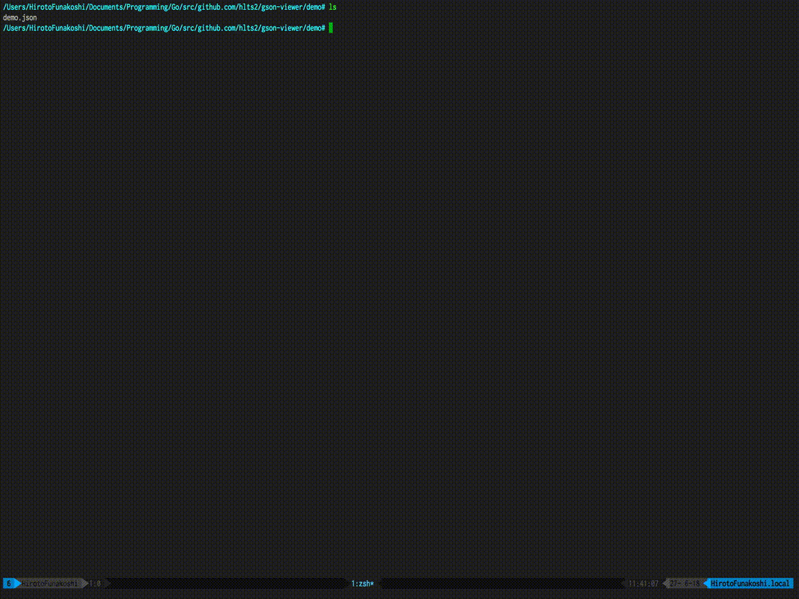

# gson-viewer [](https://opensource.org/licenses/MIT) [](https://goreportcard.com/report/github.com/hlts2/gson-viewer) [](https://gitter.im/gson-viewer/Lobby?utm_source=share-link&utm_medium=link&utm_campaign=share-link)
gson-viewer is an interactive command-line JSON viewer.

## Install

```shell
go get github.com/hlts2/gson-viewer
```

## Demo

An interactive command-line JSON viewer demo.



## Example

To launch an interactive command-line JSON viewer.

```shell

gson-viewer -s {json file}

```

### REPL Mode
#### How to get JSON value

The path is syntax such as `created_at.date`. And if you want to get the element of array, please put a number such as `friends.[0]`.

```json
{
    "friends": [
        {"name": "hlts2"},
        {"name": "hiroto"}
    ],
    "created_at": {
        "date": "2017-05-10 12:54:18",
        "timezone": "UTC"
    }
}
```

```shell
>>> friends.[1].name
// hiroto
```

#### `show` command

The `show` command shows shaped JSON

```shell
>>> show
```

#### How to exit

```
ctl-d
```
